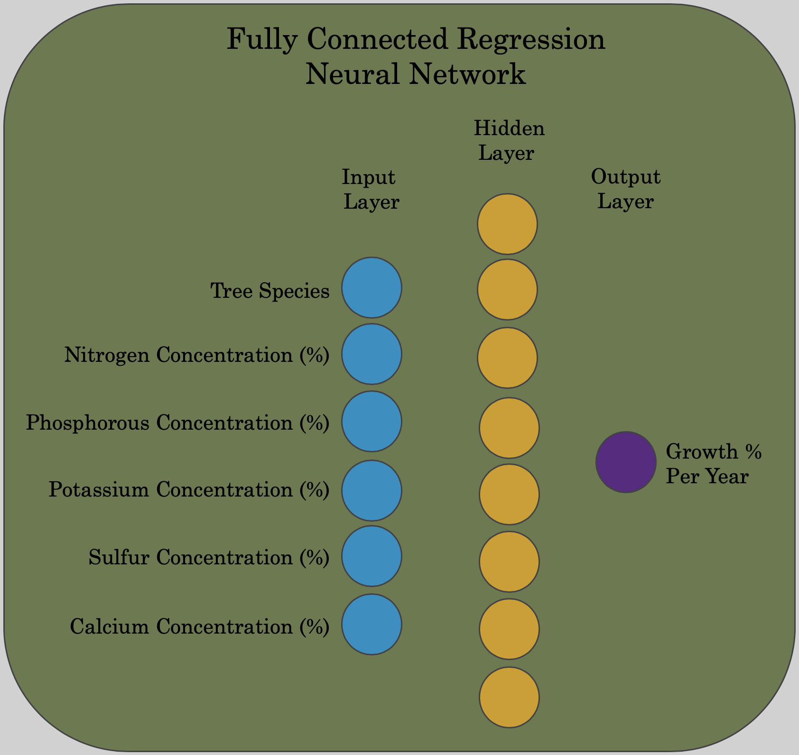
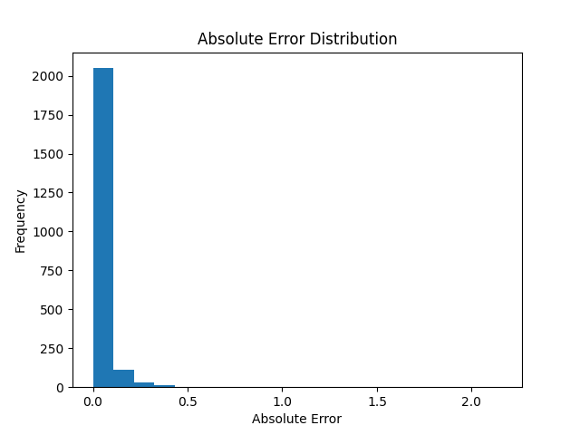
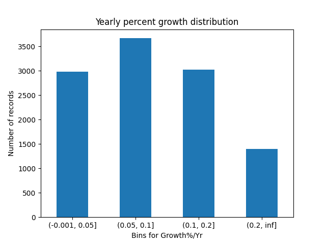

# AI-Final-Project
Using applied data science techniques to analyze a [Forest Ecology dataset](https://data.nal.usda.gov/dataset/c-55-thinning-and-fertilization-western-redcedar-c55-wrc-tf) measuring tree growth in response to thinning and fertilization in the western Olympic Peninsula over several decades.

## Environment setup
- Create fresh environment using python=3.8
- `pip install -r requirements.txt`

# Methodology

## Analysis target
Our goal was to calculate and predict the average growth per year of all trees measured in the study. We derived `Growth%/Yr` using tree width measurements from 1982, 1985, and 1990 and measured the percent change across those time periods. We then used a variety of neural network approaches to predict the `Growth%/Yr` based on a variety of input variables.

## Input variables
Several measures were used to predict tree growth:
- Tree species
- Nutrient levels in fallen foliage:
  - Nitrogen concentration (%)
  - Phosphorus concentration (%)
  - Potassium concentration (%)
  - Sulfur concentration (%)
  - Calcium concentration (%)

## Assumptions:
- A tree's growth rate is not affected by the tree's age
- Foliar nutrient levels are measured at the beginning of the growing time period
- Foliar nutrients remain constant over growth period
- Foliar nutrients for a plot is the same for all trees within that plot
- The same tree may have `Growth%/Yr` calculated from it twice (once from 82-85, once from 85-90)

## Data derivation

### **Percent growth per year**:
- D82 = 1982 Tree diameter at breast height
- D85 = 1985 Tree diameter at breast height
- D90 = 1990 Tree diameter at breast height
 
1982-1985 period `Growth%/Yr` = (D85 - D82)/(D82 * 3 Yrs)

1985-1990 period `Growth%/Yr` = (D90 - D85)/(D85 * 5 Yrs)
  
### **Foliar nutrients**:
- 1982 measurements associated with tree growth during 1982-1985 
- 1985 measurements associated with tree growth during 1985-1990

### **Tree species**:
- THPL
- TSHE
- PISI
- ALRU2
- RHPU
- TABR2
- UNCLH 
- ABAM
- ABGR
- MAFU
- TSME

# Statistical Models

## Regression
We created a fully connected neural network to predict a continuous value for growth rate per year. We attempted a variety of models but found that ReLU activation functions in a 6 / 8 / 1 architecture was the most accurate model. The final node produces a value between 0 and 1, which was the normalized version for the growth rate per year (this can be inverse transformed to produce a growth rate value).

<figure>

<figcaption align = "center"><b>Fig.1 - Neural Network Architecture</b></figcaption>
</figure>

We then used a variety of metrics to test the accuracy of our regression neural network including the mean square error, mean absolute error, and maximum absolute error. Below is a summary of the current model:
* Mean Absolute Error: 0.04
* Mean Square Error: 0.0009
* Maximum Absolute Error: 1.98

Because we are measuring Percent Growth per Year, the mean absolute error of 0.04 represents an average prediction error of 4%, and the max absolute error of 1.98 represents an outlier, with an error of 198%.

Also, we believe the mean absolute error for more than 95% of the prediction values is significantly lower than stated above. There were a handful of outliers that skew this number. This is represented in the absolute error distribution below:

<figure>

<figcaption align = "center"><b>Fig.2 - Distribution of errors from regression prediction</b></figcaption>
</figure>

As you can see in Fig.2, the vast majority of the errors are below 0.2. This means that our model is good at predicting the growth of a tree within 20% of the actual growth, given the nutrient levels and species of a tree.

<figure>

<figcaption align = "center"><b>Fig.3 - Histogram of absolute errors from regression prediction</b></figcaption>
</figure>

As well, Fig.3 shows a different view of the distribution from Fig.2 but confirms the findings that the majority of predictions contain error values located between 0.01 to 0.05, showing that over half of all `Growth%/Yr` predictions were within 1% to 5% of the actual value.

## Classification
For the classification model we created a neural network to predict which bin the growth rate would fall into. The bins for `Growth%/Yr` we chose were [0,5%], (5%, 10%], (10%, 20%], and (20%, inf) based on the distribution of records. 

<figure>

<figcaption align = "center"><b>Fig.4 - Histogram of Growth%/Yr </b></figcaption>
</figure>

Classification of continuous variables has many inherent challenges. First, there is a natural loss of information as the singular prediction value is transformed into a range of values within the bin. Second, if there is a high error in prediction, there is a large possibility of classification predictions crossing binning lines, which leads to an innacurate prediction. 

Upon running a classification model for the `Growth%/Yr` for the trees, the results were all over the place. The peak accuracy was over 50% accurate, while the worst accuracy was around 10% accurate. However, the results were inconsistent as consecutive runs using the same neural network structure at one point yielded accuracies differing by over 30%! Therefore, due to the inconsistencies in the model, as well as its inaccuracy we did not pursue the classification model further. 

## Sources:

### Data Source
Harrington, Constance A. 2020. C-55 Thinning and fertilization in western redcedar (C55 WRC TF). Fort Collins, CO: Forest Service Research Data Archive. https://doi.org/10.2737/RDS-2021-0080

### Research and Tutorial Sources
1. 3blue1brown on machine learning/neural networks:
https://www.3blue1brown.com/topics/neural-networks

2. Possible ways to increase accuracy of neural network:
https://towardsdatascience.com/how-to-increase-the-accuracy-of-a-neural-network-9f5d1c6f407d

3. How to choose activation function:
https://machinelearningmastery.com/choose-an-activation-function-for-deep-learning/

4. Batch size and epochs: 
https://towardsdatascience.com/epoch-vs-iterations-vs-batch-size-4dfb9c7ce9c9#:~:text=Note%3A%20The%20number%20of%20batches,iterations%20to%20complete%201%20epoch.

5. Discussion on layers and nodes:
https://machinelearningmastery.com/how-to-configure-the-number-of-layers-and-nodes-in-a-neural-network/

6. Classification tutorial:
https://towardsdatascience.com/building-our-first-neural-network-in-keras-bdc8abbc17f5 

7. Regression tutorial:
https://datascienceplus.com/keras-regression-based-neural-networks/

8. Scikit-learn documentation: https://scikit-learn.org/stable/

9. Keras library documentation: https://keras.io/ 

10. Loss function discussion:
https://towardsdatascience.com/deep-learning-which-loss-and-activation-functions-should-i-use-ac02f1c56aa8

11. Matplotlib documentation for histograms:
https://matplotlib.org/3.5.0/api/_as_gen/matplotlib.pyplot.hist.html